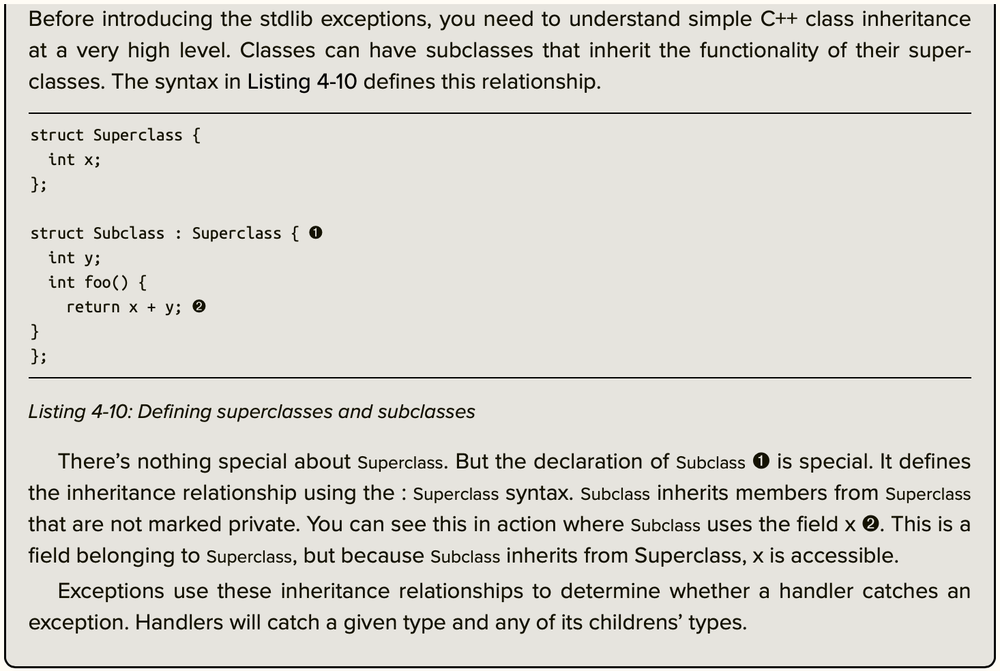
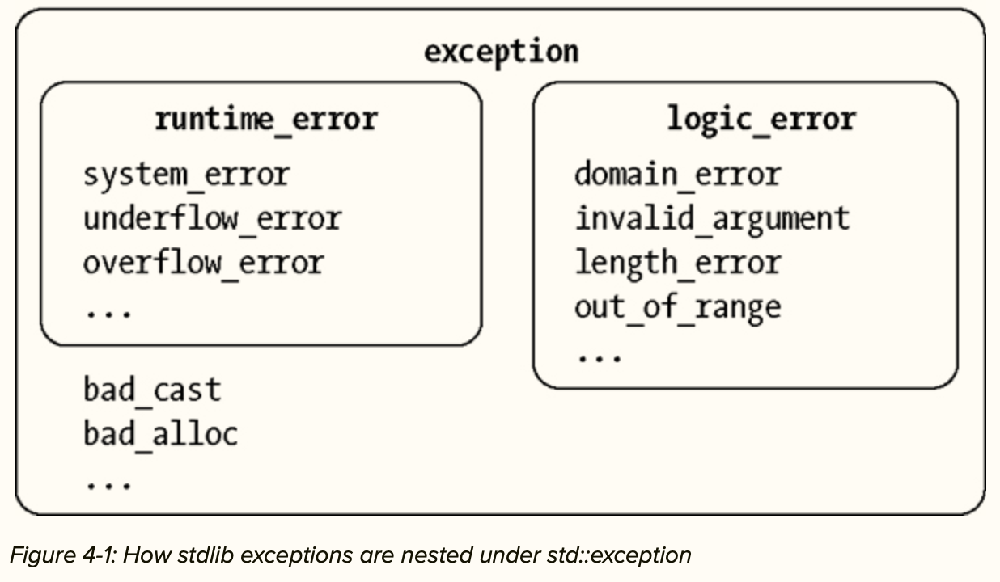
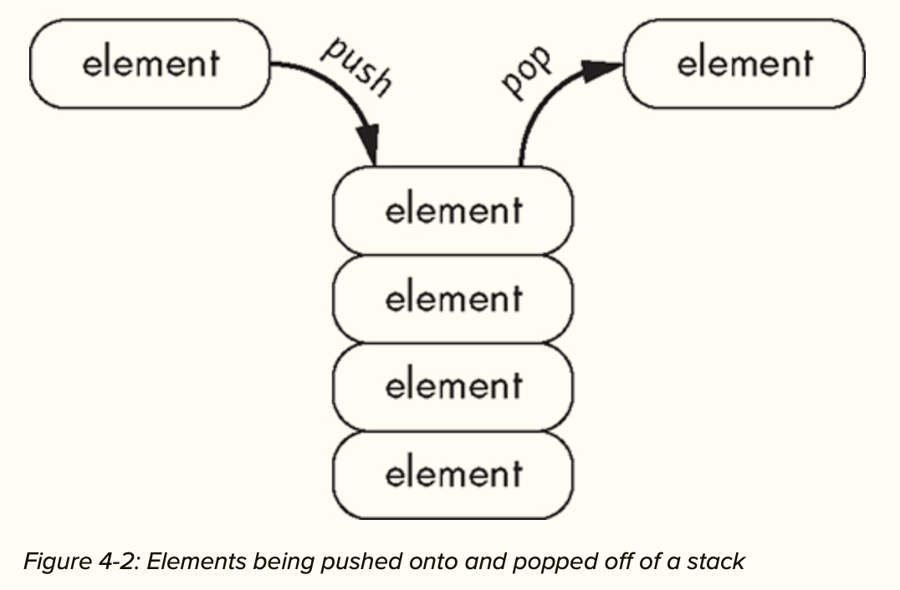

# 4. The Object Life Cycle

**Outcomes**: “You’ll learn about how the object life cycle dovetails with exceptions to handle error conditions and cleanup in a robust, safe, and elegant way. The chapter closes with a discussion of move and copy semantics that provides you with granular control over an object’s life cycle.”

## An Object's storage duration

- “An object is a region of storage that has a type and a value. When you declare a variable, you create an object. A variable is simply an object that has a name.”

### Allocation, Deallocation and Lifetime

- “each object passes through the following stages:

    - The object’s storage duration begins, and storage is allocated.
    - The object’s constructor is called.
    - The object’s lifetime begins.
    - You can use the object in your program.
    - The object’s lifetime ends.
    - The object’s destructor is called.
    - The object’s storage duration ends, and storage is deallocated.”

### Memory Management

- If you’ve been programming in an application language, chances are you’ve used an automatic memory manager, or a garbage collector. At runtime, programs create objects. Periodically, the garbage collector determines which objects are no longer required by the program and safely deallocates them. This approach frees the programmer from worrying about managing an object’s life cycle, but it incurs several costs, including runtime performance, and requires some powerful programming techniques like deterministic resource management.

- C++ takes a more efficient approach. The trade-off is that C++ programmers must have intimate knowledge of storage durations. It’s our job, not the garbage collector’s, to craft object lifetimes.

### Automatic Storage Duration

- “An automatic object is allocated at the beginning of an enclosing code block, and it’s deallocated at the end. The enclosing block is the automatic object’s scope. Automatic objects are said to have automatic storage duration. Note that function parameters are automatic, even though notationally they appear outside the function body.”

- “Because you cannot access these variables outside of function's scope, automatic variables are also called local variables.”


### Static Storage Duration

- “A static object is declared using the static or extern keyword. You declare static variables at the same level you declare functions—at global scope (or namespace scope). Static objects with global scope have static storage duration and are allocated when the program starts and deallocated when the program stops.”

- “When you use the static keyword, you specify internal linkage. Internal linkage means that a variable is inaccessible to other translation units. You can alternately specify external linkage, which makes a variable accessible to other translation units. For external linkage, you use the extern keyword instead of static”

- “a translation unit is what a preprocessor produces after acting on a single source file.”

- [static_storage_duration.cpp](./static_storage_duration.cpp)

### Local Static Variables

- “A local static variable is a special kind of static variable that is a local—rather than global—variable. Local static variables are declared at function scope, just like automatic variables. But their lifetimes begin upon the first invocation of the enclosing function and end when the program exits.”

- [local_static_variables.cpp](./local_static_variables.cpp)

- “This is an example of a programming pattern called encapsulation, which is the bundling of data with a function that operates on that data. It helps to protect against unintended modification.”


### Static Members

- “Static members are members of a class that aren’t associated with a particular instance of the class. Normal class members have lifetimes nested within the class’s lifetime, but static members have static storage duration.”

- “These members are essentially similar to static variables and functions declared at global scope; however, you must refer to them by the containing class’s name, using the scope resolution operator ::. In fact, you must initialize static members at global scope. You cannot initialize a static member within a containing class definition.”

- “Like other static variables, static members have only a single instance. All instances of a class with static members share the same member, so if you modify a static member, all class instances will observe the modification.”

- [static_members.cpp](./static_members.cpp)

- “You see the scope resolution operator in action where rat_things_power is initialized ➍ and where you invoke the static method power_up_rat_thing ➎.”

## Thread Local Storage Duration

- “One of the fundamental concepts in concurrent programs is the thread. Each program has one or more threads that can perform independent operations. The sequence of instructions that a thread executes is called its thread of execution”

- “Code that multiple threads can execute safely is called thread-safe code. Mutable global variables are the source of many thread safety issues. Sometimes, you can avoid these issues by giving each thread its own copy of a variable. You can do this by specifying that an object has thread storage duration.”

- “You can modify any variable with static storage duration to have thread-local storage duration by adding the thread_local keyword to the static or extern keyword. If only thread_local is specified, static is assumed. The variable’s linkage is unchanged”

- Modify the `local_static_variables.cpp` as : 
    ```cpp
    void power_up_rat_thing(int nuclear_isotopes){
        static thread_local int rat_things_power = 200;
        -- snip --
    }
    ```

## Dynamic Storage Duration

- “Objects with dynamic storage duration are allocated and deallocated on request. You have manual control over when a dynamic object’s life begins and when it ends. Dynamic objects are also called allocated objects for this reason.”

- “The primary way to allocate a dynamic object is with a new expression. A new expression begins with the new keyword followed by the desired type of the dynamic object. New expressions create objects of a given type and then return a pointer to the newly minted object.”

- “After allocating storage for the int, the dynamic object will be initialized as usual. After initialization completes, the dynamic object’s lifetime begins.You deallocate dynamic objects using the delete expression, which is composed of the delete keyword followed by a pointer to the dynamic object. Delete expressions always return void.”

- Initialization and deallocation of Dynamic Objects

    ```cpp
    int *my_int_ptr = new int;
    int *my_int_ptr2 = new int {42};

    delete my_int_ptr;
    ```

- “The value contained in memory where the deleted object resided is undefined, meaning the compiler can produce code that leaves anything there.”

- “You would have to implement a custom destructor to, for example, zero out some sensitive contents.”

NOTE : “Because the compiler doesn’t typically clean up memory after an object is deleted, a subtle and potentially serious type of bug called a use after free can occur. If you delete an object and accidentally reuse it, your program might appear to function correctly because the deallocated memory might still contain reasonable values. In some situations, the problems don’t manifest until the program has been in production for a long time—or until a security researcher finds a way to exploit the bug and discloses it!”

### Dynamic Arrays

- “Dynamic arrays are arrays with dynamic storage duration. You create dynamic arrays with array new expressions.”

- Syntax : 
    ```
    new MyType[n_elements]{ init-list }
    ```

- Example: 
    ```cpp
    int * my_int_array_ptr = new int[100];
    -- Do Something --
    delete[] my_int_array_ptr;
    ```

- “The number of elements ➊ doesn’t need to be constant: the size of the array can be determined at runtime, meaning the value between brackets ➊ could be a variable rather than a literal.”

- “To deallocate a dynamic array, use the array delete expression. Unlike the array new expression, the array delete expression doesn’t require a length”

### Memory Leaks

- “With privilege comes responsibility, so you must make sure that dynamic objects you allocate are also deallocated. Failure to do so causes memory leaks in which memory that is no longer needed by your program isn’t released. When you leak memory, you use up a resource in your environment that you’ll never reclaim. This can cause performance problems or worse.”

NOTE: “In practice, your program’s operating environment might clean up leaked resources for you. For example, if you’ve written user-mode code, modern operating systems will clean up the resources when the program exits. However, if you’ve written kernel code, those operating systems won’t clean up the resources. You’ll only reclaim them when the computer reboots.”

## Tracing the Object's Life Cycle

- [tracing_object_life_cycle.cpp](./tracing_object_life_cycle.cpp)


## Exceptions

- “Exceptions are types that communicate an error condition. When an error condition occurs, you throw an exception. After you throw an exception, it’s in flight. When an exception is in flight, the program stops normal execution and searches for an exception handler that can manage the in-flight exception. Objects that fall out of scope during this process are destroyed.”

- “In situations where there’s no good way to handle an error locally, such as in a constructor, you generally use exceptions. Exceptions play a crucial role in managing object life cycles in such circumstances.”

- “The other option for communicating error conditions is to return an error code as part of a function’s prototype. These two approaches are complementary. In situations where an error occurs that can be dealt with locally or that is expected to occur during the normal course of a program’s execution, you generally return an error code.”

- Exceptions use inheritance relationships to determine whether a handler catches an exception. Handlers will catch a given type and any of its childrens' types.

### The *throw* keyword

- “To throw an exception, use the throw keyword followed by a throwable object."

- "Most objects are throwable. But it’s good practice to use one of the exceptions available in stdlib, such as std::runtime_error in the <stdexcept> header. The runtime_error constructor accepts a null-terminated const char* describing the nature of the error condition. You can retrieve this message via the what method, which takes no parameters.”

- [exception_example.cpp](./exception_example.cpp)

    “When you invoked forget with the argument 0xC0DE ➋, groucho printed Forgot 0xc0de and returned. When you invoked forget with the argument 0xFACE ➌, groucho threw an exception. This exception stopped normal program execution, so forget is never invoked again ➍. Instead, the in-flight exception is caught ➎, and its message is printed ➏”

### Some brief idea about inheritance

    

## *stdlib* Exception Classes

- “Inheritance has a big impact on how the code handles exceptions. There is a nice, simple hierarchy of existing exception types available for use in the stdlib.”

### Standard Exception Classes

- “The stdlib provides you with the standard exception classes in the <stdexcept> header. These should be your first port of call when you’re programming exceptions. The superclass for all the standard exception classes is the class std::exception. All the subclasses in std::exception can be partitioned into three groups: logic errors, runtime errors, and language support errors.”

    

### Logic Errors

- **Class Invariant** : 
    - A class invariant in C++ is a property that must always hold for an object of that class. It ensures that the object remains in a valid state throughout its lifetime, from the time the constructor is called until the destructor is executed. Methods of the class should preserve the invariant, although they may temporarily break it during execution as long as it is restored before the method ends.

    - For example, in the std::vector class, a class invariant could be that the size of the vector (the number of elements it contains) is always less than or equal to its capacity (the number of elements storage has been allocated for).

- “Logic errors derive from the logic_error class. A primary example is when a logical precondition of a class isn’t satisfied, such as when a class invariant cannot be established.”

- “You can use a class constructor to check for various conditions, and if you cannot establish a class invariant, you can throw an exception. If the failure is the result of, say, passing an incorrect parameter to the constructor, a logic_error is an appropriate exception to throw.”

- The logic_error has several subclasses that you should be aware of:

    - The `domain_error` reports errors related to valid input range, especially for math functions. The square root, for example, only supports non-negative numbers (in the real case). If a negative argument is passed, a square root function could throw a domain_error.
    - The `invalid_argument` exception reports generally unexpected arguments.
    - The `length_error` exception reports that some action would violate a maximum size constraint.
    - The `out_of_range` exception reports that some value isn’t in an expected range. The canonical example is bounds-checked indexing into a data structure.


### Runtime Errors

- “Runtime errors derive from the runtime_error class. These exceptions help you report error conditions that are outside the program’s scope”

- `runtime_error` has some subclasses that you might find useful:

    - The `system_error` reports that the operating system encountered some error. You can get a lot of mileage out of this kind of exception. Inside of the <system_error> header, there’s a large number of error codes and error conditions. When a `system_error` is constructed, information about the error is packed in so you can determine the nature of the error. The `.code()` method returns an enum class of type `std::errc` that has a large number of values, such as `bad_file_descriptor`, `timed_out`, and `permission_denied`.
    - The `overflow_error` and `underflow_error` report arithmetic overflow and underflow, respectively.

- “Other errors inherit directly from exception. A common one is the `bad_alloc` exception, which reports that `new` failed to allocate the required memory for dynamic storage.”

### Language Support Errors

- “You won’t use language support errors directly. They exist to indicate that some core language feature failed at runtime.”


## Handling Exceptions

- “The rules for exception handling are based on class inheritance. When an exception is thrown, a catch block handles the exception if the thrown exception’s type matches the catch handler’s exception type or if the thrown exception’s type inherits from the catch handler’s exception type.”

- “Special handlers are typically used as a safety mechanism to log the program’s catastrophic failure to catch an exception of a specific type.”

- “You can handle different types of exceptions originating from the same try block by chaining together catch statements.”


- eg: 
    ```cpp
    try {
        // Code that might throw an exception
        -- snip --
    } 
    catch (const std::logic_error& ex){
        // Log exception and terminate the program; There is a programming error!
        -- snip --
    }
    catch (const std::runtime_error& ex){
        // Do our best to recover gracefully
        -- snip --
    }
    catch (const std::exception& ex){
        // This will hand;e any exception that derives from std::exception 
        // that is not a logic or a runtime_error
        -- snip --
    }
    catch (...){
        // Panic; un unforeseen exception type was thrown
        -- snip --
    }

- “Rather than rethrowing, you can define a new exception type and create a separate catch handler for the `EACCES` error.”

    ```cpp
    try {
        // Throw a PermissionDenied instead
        -- snip --
    } catch (const PermissionDenied& ex){
        // Recover from an EACCES error (Permission denied error)
        -- snip --
    }


### User Defined Exceptions

- “You can define your own exceptions whenever you’d like; usually, these user-defined exceptions inherit from `std::exception`. All the classes from stdlib use exceptions that derive from `std::exception`. This makes it easy to catch all exceptions, whether from your code or from the stdlib, with a single catch block.”

### The `noexcept` keyword

- “You can, and should, mark any function that cannot possibly throw an exception `noexcept`.”
    ```cpp
    bool is_odd(int x) noexcept{
        return 1 == (x % 2);
    }
    ```

- “Functions marked noexcept make a rigid contract. When you’re using a function marked noexcept, you can rest assured that the function cannot throw an exception. In exchange, you must be extremely careful when you mark your own function noexcept, since the compiler won’t check for you. If your code throws an exception inside a function marked noexcept, it’s bad juju. The C++ runtime will call the function std::terminate, a function that by default will exit the program via abort. Your program cannot recove”

    ```cpp
    void hari_kari() noexcept{
        throw std::runtime_error {"Goodbye, cruel world."};
    }
    ```

NOTE: “Check out Item 14 of Effective Modern C++ by Scott Meyers for a thorough discussion of noexcept. The gist is that some move constructors and move assignment operators might throw an exception, for example, if they need to allocate memory and the system is out. Unless a move constructor or move assignment operator specifies otherwise, the compiler must assume that a move could cause an exception. This disables certain optimizations.”

## Call Stacks and Exceptions

- “The call stack is a runtime structure that stores information about active functions. When a piece of code (the caller) invokes a function (the callee), the machine keeps track of who called whom by pushing information onto the call stack. This allows programs to have many function calls nested within each other. The callee could then, in turn, become the caller by invoking another function.”

### Stacks

- “A stack is a flexible data container that can hold a dynamic number of elements. There are two essential operations that all stacks support: pushing elements onto the top of the stack and popping those elements off. It is a last-in, first-out data structure”

- “As its name suggests, the call stack is functionally similar to its namesake data container. Each time a function is invoked, information about the function invocation is arranged into a stack frame and pushed onto the call stack. Because a new stack frame is pushed onto the stack for every function call, a callee is free to call other functions, forming arbitrarily deep call chains. Whenever a function returns, its stack frame is popped off the top of the call stack, and execution control resumes as indicated by the previous stack frame”

    


### Call Stacks and Exception Handling

- “The runtime seeks the closest exception handler to a thrown exception. If there is a matching exception handler in the current stack frame, it will handle the exception. If no matching handler is found, the runtime will unwind the call stack until it finds a suitable handler. Any objects whose lifetimes end are destroyed in the usual way.”


### Throwing in Destructors

- If you throw an exception in a destructor, you are juggling with chainsaws. Such an exception absolutely must be caught within the destructor.

- “Suppose an exception is thrown, and during stack unwinding, another exception is thrown by a destructor during normal cleanup. Now you have two exceptions in flight. How should the C++ runtime handle such a situation?”

- As a general rule, treat destructors as if they were `noexcept`.

- [throwing_in_destructors.cpp](./)


## A SimpleString Class

- 