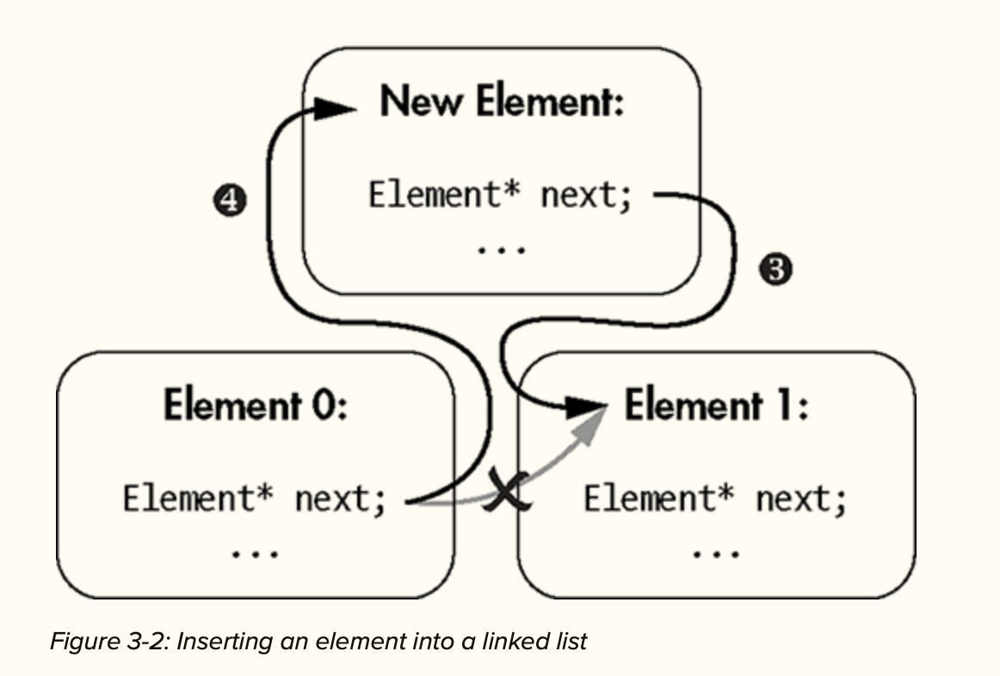

# Chapter 3. Reference Types

## Pointers & Addressing Variables
- The variation in memory address space is  due to `Space Layout Radomization`, which is a security feature that scrambles the base address of important memory regions to hamper exploitation.

<details>
<summary> Address Space Layout Randomization </summary>
“Why does address space layout randomization hamper exploitation? When a hacker finds an exploitable condition in a program, they can sometimes cram a malicious payload into user-provided input. One of the first security features designed to prevent a hacker from getting this malicious payload to execute is to make all data sections non-executable. If the computer attempts to execute data as code, then the theory is that it knows something’s amiss and should terminate the program with an exception.
<br/>
<br/>
Some exceedingly clever hackers figured out how to repurpose executable code instructions in totally unforeseen ways by carefully crafting exploits containing so-called return-oriented programs. These exploits could arrange to invoke the relevant system APIs to mark their payload executable, hence defeating the non-executable-memory mitigation.
<br/>
Address space layout randomization combats return-oriented programming by randomizing memory addresses, making it difficult to repurpose existing code because the attacker doesn’t know where it resides in memory.”

</details>

## Dereferencing Pointers

- “The dereference operator (*) is a unary operator that accesses the object to which a pointer refers. This is the inverse operation of the address-of operator. Given an address, you can obtain the object residing there”

## Member of Pointer Operator

- The member-of-pointer operator or an arrow operator (->) performs two simultaneous operations : 
    - It dereferences a pointer.
    - It accesses a member of the pointed-to object.


## Pointers and Arrays

- “Pointers share several characteristics with arrays. Pointers encode object location. Arrays encode the location and length of contiguous objects.
At the slightest provocation, an array will decay into a pointer. A decayed array loses length information and converts to a pointer to the array’s first element”

### Handling Decay
- We shall pass arrays with 2 arguments:
    - A pointer to the first array element
    - the array's length

### Pointer Arithmetic
- “To obtain the address of the nth element of an array, you have two options. First, you can take the direct approach of obtaining the nth element with square brackets ([]) and then use the address-of (&) operator.”
```cpp
College* third_college_ptr = &oxford[2];
```

- “Pointer arithmetic, the set of rules for addition and subtraction on pointers, provides an alternate approach. When you add or subtract integers to pointers, the compiler figures out the correct byte offset using the size of the pointed-to type.”
```cpp
College* third_college_ptr = oxford + 2;
```

## Pointers are Dangerous

### Buffer Overflows

- “For arrays and pointers, you can access arbitrary array elements with the bracket operator ([]) or with pointer arithmetic. These are very powerful tools for low-level programming because you can interact with memory more or less without abstraction.”
- “By accessing the element past the storage allotted to lower. No bounds checking occurs; this code compiles without warning.”

### *void* Pointers and *std::byte* Pointers

- “Sometimes the pointed-to type is irrelevant. In such situations, you use the void pointer void*. The void pointers have important restrictions, the principal of which is that you cannot dereference a void*. Because the pointed-to type has been erased, dereferencing makes no sense (recall that the set of values for void objects is empty). For similar reasons, C++ forbids void pointer arithmetic.”

- “Other times, you want to interact with raw memory at the byte level. Examples include low-level operations like copying raw data between files and memory, encryption, and compression. You cannot use a void pointer for such purposes because bit-wise and arithmetic operations are disabled. In such situations, you can use a std::byte pointer.”

### *nullptr* and Boolean Expressions:

- “Pointers can have a special literal value, nullptr. Generally, a pointer that equals nullptr doesn’t point to anything. You could use nullptr to indicate, for example, that there’s no more memory left to allocate or that some error occurred.
- Pointers have an implicit conversion to bool. Any value that is not nullptr converts implicitly to true, whereas nullptr converts implicitly to false. This is useful when a function returning a pointer ran successfully. A common idiom is that such a function returns nullptr in the case of failure. The canonical example is memory allocation.”

## References

- “References are safer, more convenient versions of pointers. You declare references with the & declarator appended to the type name. References cannot be assigned to null (easily), and they cannot be reseated (or reassigned). These characteristics eliminate some bugs endemic to pointers.”

## Usage of Pointers and References

- “Pointers and references are largely interchangeable, but both have trade-offs. If you must sometimes change your reference type’s value—that is, if you must change what your reference type refers to—you must use a pointer. Many data structures (including forward-linked lists) require that you be able to change a pointer’s value. Because references cannot be reseated and they shouldn’t generally be assigned to nullptr, they’re sometimes not suitable.”

### *Forward-Linked Lists*: The Canonical Pointer-Based Data Structure

- “A forward-linked list is a simple data structure made up of a series of elements. Each element holds a pointer to the next element. The last element in the linked list holds a nullptr. Inserting elements into a linked list is very efficient, and elements can be discontinuous in memory”

    


### *this* Pointers

- “When you program a method, sometimes you need to access the current object, which is the object that is executing the method. Within method definitions, you can access the current object using the this pointer”


## *const* Correctness 

- “The keyword const (short for “constant”) roughly means “I promise not to modify.” It’s a safety mechanism that prevents unintended (and potentially catastrophic) modifications of member variables.”

- “When used correctly, const is one of the most powerful language features in all modern programming languages because it helps you to eliminate many kinds of common programming mistakes at compile time.”

### const Arguments

- “Marking an argument const precludes its modification within a function’s scope. A const pointer or reference provides you with an efficient mechanism to pass an object into a function for read-only use.”

### const Methods

- “Marking a method const communicates that you promise not to modify the current object’s state within the const method. Put another way, these are read-only methods.”

- “To mark a method const, place the const keyword after the argument list but before the method body.”


### const Member variables

- “You can mark member variables const by adding the keyword to the member’s type. The const member variables cannot be modified after their initialization”

- “Sometimes you want the safety of marking a member variable const but would also like to initialize the member with arguments passed into a constructor. For this, you employ member initializer lists.”


### *Member Initializer Lists*

- “Member initializer lists are the primary mechanism for initializing class members. To declare a member initializer list, place a colon after the argument list in a constructor. Then insert one or more comma-separated member initializers. A member initializer is the name of the member followed by a `braced initialization { }`. Member initializers allow you to set the value of const fields at runtime.”

- All member initializations execute before the constructor's body. This has two advantages:
    
    - It ensures validity of all members before the constructor executes, so you can focus on initilization logic rather than member error checking.
    
    - The members initialize once. If you reassign members in the constructor, you potentially do extra work.

NOTE: You should order the member initalizers in the same order they appear in the class definition, because their constructors will be called in this order.


## *auto* Type Deduction

- “As a strongly typed language, C++ affords its compiler a lot of information. When you initialize elements or return from functions, the compiler can divine type information from context. The auto keyword tells the compiler to perform such a divination for you, relieving you from inputting redundant type information.”

### *auto* and *Reference* types

- “It’s common to add modifiers like &, *, and const to auto. Such modifications add the intended meanings (reference, pointer, and const, respectively):”

- “if you add a modifier, the resulting type is guaranteed to have that modifier.”

### *auto and Code refactorings*

- “The auto keyword assists in making code simpler and more resilient to refactoring.”
